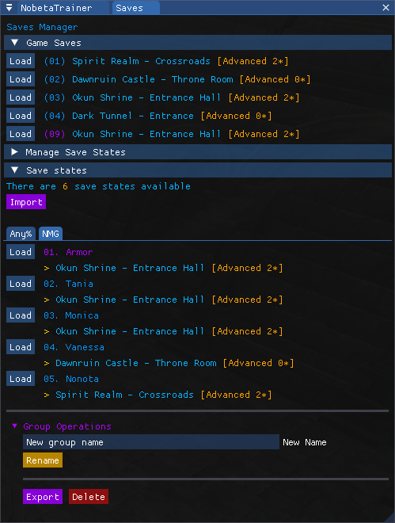
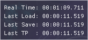
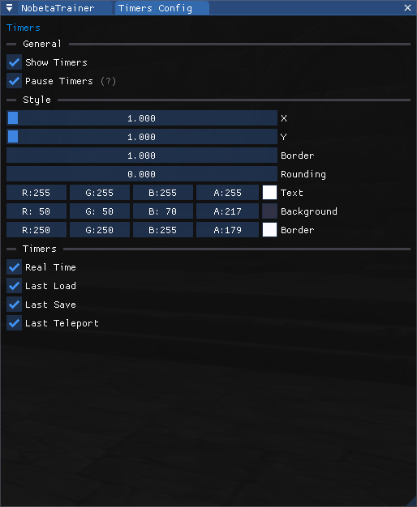
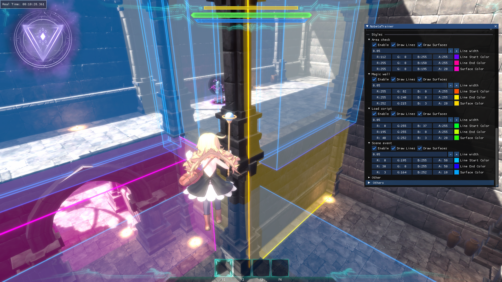

# Nobeta Trainer


> A **Little Witch Nobeta** tool to help train speedrunning and discovering how the game mechanics work

# Documentation

- [Compatibility](#compatibility)
- [Installation](#installation)
- [Features](#features)
  - [Trainer](#trainer)
  - [Inspector](#inspector)
  - [Teleportation](#teleportation)
  - [Save Manager](#save-manager)
  - [Timers](#timers)
  - [Colliders Renderer](#colliders-renderer)
  - [Shortcuts](#shortcuts)
  - [ImGui tips](#imgui-tips)
- [Bug report and help](#bug-report-and-help)
- [Contributing](#contributing)
- [Used libraries](#used-libraries)
- [Licence](#licence)

## Compatibility

This Trainer is tested and developed on **latest game version** (`1.1.0` at the moment of writing this) and comes with a **compatiblity mode** for older versions (`1.0.3.1`, `1.0.3.3`, `...`), note that this compatibility mode may have some bugs or lack features, please open an issue or contact me if you find any.

## Installation

This plugin modifies the game using [BepInEx](https://github.com/BepInEx/BepInEx), so it is needed to install BepInEx to load this plugin, here are the steps to achieve this:
- Find the installation directory of the game *(Usually in `steamapps/common`, you can find this from the game properties in steam -> local files -> browse...)*
- **/!\ Do a copy of your game installation and rename it `Little Witch Nobeta - Trainer`** *(The changes are reversible but a pain to do, furthermore it's easier to have two versions of the game, one with the trainer and the base one)*
- You should now have at least two folders in the `steamapps/common` directory: `Little Witch Nobeta` *(base game)* and `Little Witch Nobeta - Trainer` *(will be modded with the Trainer)*
- Download corresponding version of the Trainer
  - For game version **≥ 1.1.0:** [**`NobetaTrainer.zip`**](/../../releases/latest/download/NobetaTrainer.zip)
  - For game version **< 1.1.0 *(1.0.3.1, 1.0.3.3, ...)*:** [**`NobetaTrainer_compat.zip`**](/../../releases/latest/download/NobetaTrainer_compat.zip)
- Copy all the files from the archive inside the game directory *(Where there is `LittleWitchNobeta.exe`)*
- Now you should see a file named `imgui.ini` just next to `LittleWitchNobeta.exe`
- Create a shortcut to `LittleWitchNobeta.exe`, name it as you want, run the game and enjoy!

A correct installation directory content should look like this:
```
.
├── BepInEx
├── dotnet
├── LittleWitchNobeta_Data
├── GameAssembly.dll
├── LittleWitchNobeta.exe
├── UnityCrashHandler64.exe
├── UnityPlayer.dll
├── baselib.dll
├── changelog.txt
├── doorstop_config.ini
├── imgui.ini
└── winhttp.dll
```

## Features

> **By default, you can unlock the cursor at any time using the `alt` key on your keyboard !**

### Trainer


This is the main Trainer window, from here you can open the other windows *(Inspector, Teleportation, Shortcut Editor)* and get access to general features.

> Some features have a grey (?) indicator, if you hover your mouse on it you can get a, explanation of the feature

### Inspector


This window shows a lot informations about the game and the engine used. All those values are taken directly from the game code and updated in **real time**.

> *From here you can also get access to internal ImGui windows for debug purposes*

### Teleportation


This window allows you to teleport to the level save points *(statues)* and treasure chests. In addition, you can create your **own teleportation** points in the "custom" section, those are saved permanently and can be reused after restarting the game.

> Note that all the teleportation points are level-dependant so you will only see teleportation points for the specific level you're in
> 
> Teleportation points also takes rotation into account, you can see a preview of the position and rotation that will be saved when creating a custom teleportation point

> A config file with predefined teleportation points for each stage can be [downloaded here](SampleConfigs/TeleportationPoints.json) (replace the default file in `game_root\BepInEx\config\NobetaTrainer\`)  
> Thanks to *MichaelK__* for sharing this file

### Save Manager



> **Disclaimer!** Using save states will override the game save in slot 9 so you will lose all data that is stored in this slot if you use save states. However, if you did the installation of the trainer correctly it won't impact your game saves on the legit version of the game.

This window allows to load **game saves** _(from slot 1 to 9)_ and **save states**. Save states are immutable (non-modifiable) copies of a game save at a certain point in time and are always loaded in slot 9.

Save states are **organized in groups** and are listed in **alphabetical order** so if you want to have a custom order you will need to add some kind of prefix to the save state names _(for example numbering them as shown in the screenshot above)_.

Save states can also contain a **teleportation point** where Nobeta will be teleported when loading the save state if specified.

It is also possible **to export and import save state groups** to share them with other people.

> A Nobeta Save States _(nss)_ archive is available for each NMG Advanced speedrun split, it can be [downloaded here](SampleConfigs/NMG%20%5BA%5D.nss.json) _(Use the purple 'Import' button to import them)_.  
> If you want to share your own save states don't hesitate to message me on discord or open a pull request/issue

### Timers



This feature allows you to see different timers that can be paused while opening the menu, they always start on player inputs except for the `Real Time` one.

They can be configured in the `Timers Config` window.



### Colliders Renderer

This features allows to display **borders and surfaces** of different types of colliders used in the game. As of now, only **BoxColliders** are rendered, it includes most of the scene objects and all scene events *(triggers)* in the game like cutscene and magic wall triggers. The next step is to render [CharacterController](https://docs.unity3d.com/Manual/class-CharacterController.html) colliders *(Nobeta and enemies)*.



> It is possible to change the colors and what is displayed for each type of collider
>
> The config for the colors used in the example above can be [downloaded here](SampleConfigs/ColliderRenderers.json) (replace the default file in `game_root\BepInEx\config\NobetaTrainer\`)

### Shortcuts


This is where you can define and edit shortcuts to execute predefined commands. For example you can set a command to toggle Glide using "Ctrl + G".  
This is also where you can change the `Unlock Cursor` keybinding and add a `Toggle Overlay` shortcut to hide/show the overlay with a simple key press.

> **All shortcuts are disabled while the `Shortcut Editor` window is open, close the window to test your new shortcuts**
> 
> *Using a gamepad to execute commands should work too but it has not been tested*

### ImGui tips

This Trainer use [ImGui](https://github.com/ocornut/imgui) for the graphic part, here are some handy shortcuts/tips that can be used:
- To resize a window, hold left click on the little blue triangle in bottom-right corner of any window
- It is possible to "dock" windows by moving a window on top of another one. Likewise, it is possible to "split" docked windows by moving a window outside of it's dock area
- Ctrl + click on a slider/drag will allow you to set a custom value, even one outside the standard range (for example you can set thunder magic level to 99 this way)
- Shift/Alt + drag on a slider/drag will change the increment steps (slower or faster)
- Click on a color preview to open a complete color picker

## Bug report and help

If you found a bug or need help with the Trainer, you can either [open a new issue](/../../issues) or you can find me on the [Little Witch Nobeta Speedruns Discord](https://discord.gg/3FMeB4m).

Please send a copy of the log file in `BepInEx\LogOutput.log` in case you found a bug before starting the game again to help me diagnose the issue.

## Contributing

This repository accepts contributions, don't hesite to [open a new issue](/../../issues) before doing a pull request for major changes or new features.

## Used libraries

This Trainer tool couldn't be made without these awesome libraries and tools:
- [BepInEx](https://github.com/BepInEx/BepInEx) - *licensed under the LGPL-2.1 license*
- [ImGui](https://github.com/ocornut/imgui) - *licensed under the MIT license*
- [ClickableTransparentOverlay](https://github.com/zaafar/ClickableTransparentOverlay) - *licensed under the Apache-2.0 license*
- [Humanizer](https://github.com/Humanizr/Humanizer) - *licensed under the MIT license*
- [NativeFileDialogSharp](https://github.com/milleniumbug/NativeFileDialogSharp) - *licensed under the Zlib license*

## Licence

*This software is licensed under the [MIT license](LICENSE), you can modify and redistribute it freely till you respect the respective [Used libraries](#used-libraries) licenses*
