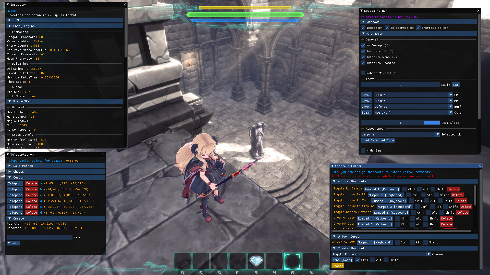
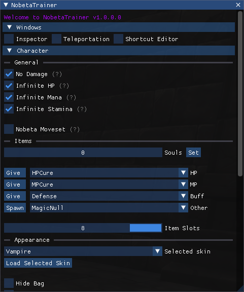
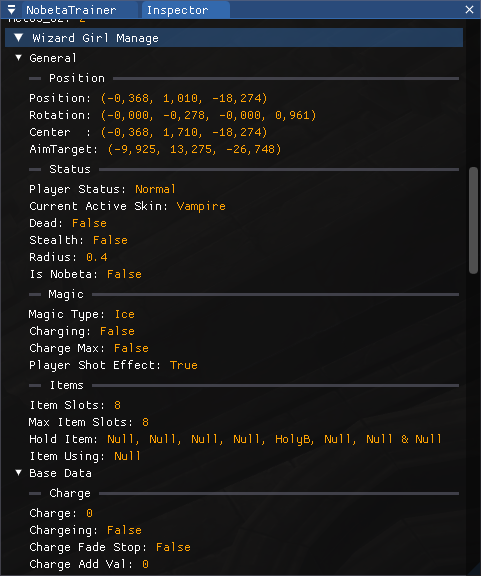
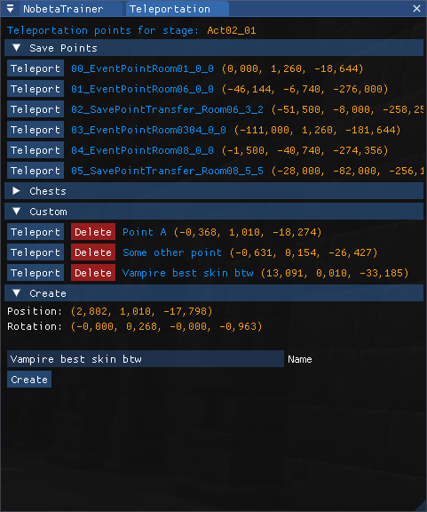
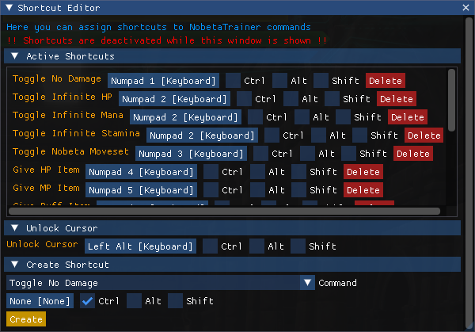

# Nobeta Trainer



> A **Little Witch Nobeta** tool to help train speedrunning and discovering how the game mechanics work

# Documentation

- [Installation](#installation)
- [Features](#features)
  - [Trainer](#trainer)
  - [Inspector](#inspector)
  - [Teleportation](#teleportation)
  - [Timer](#timer)
  - [Shortcuts](#shortcuts)
  - [ImGUI tips](#imgui-tips)
- [Bug report and help](#bug-report-and-help)
- [Contributing](#contributing)
- [Used libraries](#used-libraries)
- [Licence](#licence)


## Installation

This plugin modifies the game using [BepInEx](https://github.com/BepInEx/BepInEx), so it is needed to install BepInEx to load this plugin, here are the steps to achieve this:
- Find the installation directory of the game *(Usually in `steamapps/common`, you can find this from the game properties in steam -> local files -> browse...)*
- **/!\ Do a copy of your game installation and rename it `Little Witch Nobeta - Trainer`** *(The changes are reversible but a pain to do, furthermore it's easier to have two versions of the game, one with the trainer and the base one)*
- You should know have at least two folders in the `steamapps/common` directory: `Little Witch Nobeta` *(base game)* and `Little Witch Nobeta - Trainer` *(will be modded with the Trainer)*
- Download corresponding version of the Trainer
  - For game version >= 1.0.5: [`NobetaTrainer.zip`](/../../releases/latest/download/NobetaTrainer.zip)
  - For game version 1.0.3.1 and 1.0.3.3: [`NobetaTrainer_v1.0.3.1.zip`](/../../releases/latest/download/NobetaTrainer_v1.0.3.1.zip)
- Copy all the files from the archive inside the game directory *(Where there is `LittleWitchNobeta.exe`)*
- Now you should see a file named `imgui.ini` just next to `LittleWitchNobeta.exe`
- Create a shortcut to `LittleWitchNobeta.exe`, name it as you want, run the game and enjoy!

A correct installation directory content should look like this:
```
.
├── BepInEx
├── dotnet
├── LittleWitchNobeta_Data
├── GameAssembly.dll
├── LittleWitchNobeta.exe
├── UnityCrashHandler64.exe
├── UnityPlayer.dll
├── baselib.dll
├── changelog.txt
├── doorstop_config.ini
├── imgui.ini
└── winhttp.dll
```

## Features

> **By default, you can unlock the cursor at any time using the `alt` key on your keyboard !**

### Trainer



This is the main Trainer window, from here you can open the other windows *(Inspector, Teleportation, Shortcut Editor)* and get access to general features.

> Some features have a grey (?) indicator, if you hover your mouse on it you can get a, explanation of the feature

### Inspector



This window shows a lot informations about the game and the engine used. All those values are taken directly from the game code and updated in **real time**.

> *From here you can also get access to internal ImGUI windows for debug purposes*

### Teleportation



This window allows you to teleport to the level save points *(statues)* and treasure chests. In addition, you can create your **own teleportation** points in the "custom" section, those are saved permanently and can be reused after restarting the game.

> Note that all the teleportation points are level-dependant so you will only see teleportation points for the specific level you're in
> 
> Teleportation points also takes rotation into account, you can see a preview of the position and rotation that will be saved when creating a custom teleportation point

### Timer

> Not implemented as of now

### Shortcuts



This is where you can define and edit shortcuts to execute predefined commands. For example you can set a command to toggle Glide using "Ctrl + G".  
This is also where you can change the `Unlock Cursor` keybinding and add a `Toggle Overlay` shortcut to hide/show the overlay with a simple key press.

> **All shortcuts are disabled while the `Shortcut Editor` window is open, close the window to test your new shortcuts**
> 
> *Using a gamepad to execute commands should work too but it has not been tested*

### ImGUI tips

This Trainer use [ImGui](https://github.com/ocornut/imgui) for the graphic part, here are some handy shortcuts/tips that can be used:
- To resize a window, hold left click on the little blue triangle in bottom-right corner of any window
- It is possible to "dock" windows by moving a window on top of another one. Likewise, it is possible to "split" docked windows by moving a window outside of it's dock area
- Ctrl + click on a slider/drag will allow you to set a custom value, even one outside the standard range (for example you can set thunder magic level to 99 this way)
- Shift/Alt + drag on a slider/drag will change the increment steps (slower or faster)
- Click on a color preview to open a complete color picker

## Bug report and help

If you found a bug or need help with the Trainer, you can either [open a new issue](/../../issues) or you can find me on the [Little Witch Nobeta Speedruns Discord](https://discord.gg/3FMeB4m).

Please send a copy of the log file in `BepInEx\LogOutput.log` in case you found a bug before starting the game again to help me diagnose the issue.

## Contributing

This repository accepts contributions, don't hesite to [open a new issue](/../../issues) before doing a pull request for major changes or new features.

## Used libraries

This Trainer tool couldn't be made without these awesome libraries and tools:
- [BepInEx](https://github.com/BepInEx/BepInEx) - *licensed under the LGPL-2.1 license*
- [ImGui](https://github.com/ocornut/imgui) - *licensed under the MIT license*
- [ClickableTransparentOverlay](https://github.com/zaafar/ClickableTransparentOverlay) - *licensed under the Apache-2.0 license*
- [Humanizer](https://github.com/Humanizr/Humanizer) - *licensed under the MIT license*

## Licence

*This software is licensed under the [MIT license](LICENSE), you can modify and redistribute it freely till you respect the respective [Used libraries](#used-libraries) licenses*
